# 발음 입모양 시각 자료 QA 분석 및 개선 계획서

> 작성일: 2026-03-21
> 버전: v5 (정적 입모양 클로즈업)
> 스크린샷 도구: Playwright + Chromium
> 대상: 전체 37개 유닛, 371개 단어

---

## 1. 현재 구현 상태 요약

### 기술 구조

| 컴포넌트 | 파일 | 역할 |
|----------|------|------|
| `HumanMouthCharacter` | `src/app/lesson/[unitId]/HumanMouthCharacter.tsx` | SVG 기반 입 클로즈업 렌더링 (15 viseme) |
| `MouthVisualizer` | `src/app/lesson/[unitId]/MouthVisualizer.tsx` | 래퍼: 비디오 우선 → 캐릭터 fallback |
| `visemeMap.ts` | `src/data/visemeMap.ts` | 44개 음소 → 15개 viseme 매핑 |
| `pronunciationGuide.ts` | `src/data/pronunciationGuide.ts` | 21개 음소 교육 데이터 (난이도, 팁) |

### 렌더링 방식

```
currentPhoneme (예: "θ")
  → phonemeToViseme["θ"] → "dental"
  → MOUTH_STATES["dental"] → SVG path 데이터
  → HumanMouthCharacter 렌더링 (정적 입모양)
```

### 적용 위치 (LessonClient.tsx)

| 레슨 스텝 | 줄 | 용도 |
|----------|-----|------|
| Sound Focus | L642 | 유닛 targetSound의 대표 입모양 |
| Blend & Tap | L859 | 단어 발음 후 입모양 표시 |
| Say & Check | L1139 | STT 전 발음 가이드 |

---

## 2. 15개 Viseme 스크린샷 (Playwright 캡처)

### 2.1 Short Vowels (단모음)

#### /æ/ — open_front (입 가장 크게 벌림)
> Unit 1: cat, bat, hat, mat, rat, sat, fan, van, can, man...


**시각 특징**: 입 최대 벌림, 윗니+아랫니 모두 보임, 입 안쪽 어두운 빨간색
**한국어 비교**: "애"보다 턱을 더 크게 벌림 — 손가락 2개 들어가는 정도

---

#### /ɛ/ — mid_front (중간 벌림)
> Unit 2: bed, red, pen, hen, ten, men, net...

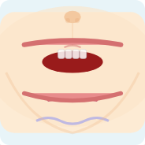

**시각 특징**: 중간 정도 벌림, 윗니 보임, /æ/보다 확연히 작은 벌림
**한국어 비교**: "에"와 비슷하지만 턱이 살짝 더 내려감

---

#### /ɪ/ — close_front (넓게 당긴 웃는 모양)
> Unit 3: big, pig, dig, sit, hit, bit, fin, pin...

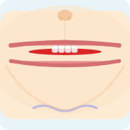

**시각 특징**: 입을 넓게 옆으로 당김 ("치즈~" 모양), 윗니 보임, 벌림 적음
**한국어 비교**: "이"와 비슷하지만 더 편안하게

---

#### /ɒ/ — open_back (둥근 O)
> Unit 4: dog, hot, box, fox, pot, top, hop...

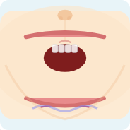

**시각 특징**: 입을 크고 둥글게 벌림, 입 폭이 좁고 세로로 큼
**한국어 비교**: "오"보다 턱이 훨씬 더 내려감

---

#### /ʌ/ — mid_central (편안한 입)
> Unit 5: bug, cup, sun, run, fun, bun, nut...


**시각 특징**: 가장 편안한(relaxed) 입, 중간 벌림, 힘이 빠진 상태
**한국어 비교**: "어"와 비슷, 입에 힘을 빼고

---

### 2.2 Long Vowels (장모음)

#### /eɪ/ — mid_front (Long a)
> Unit 7: cake, bake, lake, make, take, name, game...


**시각 특징**: /ɛ/와 같은 viseme (mid_front), 실제로는 /ɛ/→/ɪ/ 전환하는 이중모음
**개선 필요**: 이중모음 특성을 보여주는 2단계 이미지 고려

---

#### /aɪ/ — open_front (Long i)
> Unit 8: bike, like, hike, time, lime, kite...

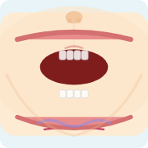

**시각 특징**: /æ/와 같은 viseme (open_front), 실제로는 /a/→/ɪ/ 전환
**개선 필요**: /æ/와 동일하게 보임 — 차별화 필요

---

#### /oʊ/ — close_back (Long o)
> Unit 9: bone, cone, home, hope, nose, rose...

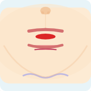

**시각 특징**: 입 작게 오므림, 유성음 파동 표시, 입 폭 좁음
**한국어 비교**: "오"를 길게 → "우" 방향으로 이동

---

#### /juː/ — close_front (Long u)
> Unit 10: cute, mute, cube, tube, tune...

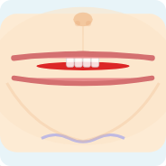

**시각 특징**: /ɪ/와 같은 viseme (close_front)
**개선 필요**: /ɪ/와 차별화 — /juː/는 입을 더 오므려야 함

---

#### /iː/ — close_front (ee/ea)
> Unit 11: bee, see, tree, free, seed, feed...

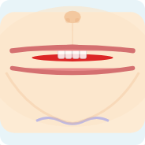

**시각 특징**: /ɪ/와 같은 viseme이지만 더 팽팽하게 당기는 느낌
**개선 필요**: /ɪ/ vs /iː/ 차이를 시각적으로 표현하기 어려움

---

### 2.3 Blends & Digraphs

#### bl/cl/fl — blends (혼합)
> Unit 13: black, block, blue, clap, clip, flag, flat...

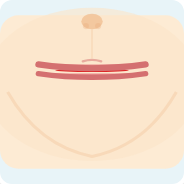

**시각 특징**: 첫 음소(b→bilabial)의 viseme 표시
**참고**: blend 유닛은 복합 targetSound — 첫 번째 음소 기준 표시

---

#### /ʃ tʃ/ — postalveolar (sh/ch)
> Unit 17: ship, shop, shoe, chat, chin, chip, fish...

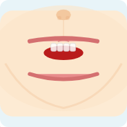

**시각 특징**: 입 둥글게 앞으로 내밈, 공기 흐름 화살표 표시
**한국어 비교**: "쉬"할 때의 입 모양, 하지만 입술을 더 둥글게

---

#### /θ ð/ — dental (th) ⭐ 가장 중요
> Unit 19: this, that, them, thin, thick, think, three...

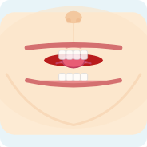

**시각 특징**: ★ **이빨 사이에 혀(분홍색)가 보임** — 핵심 시각 표현
윗니+아랫니 사이로 혀끝 돌출, 공기 흐름 화살표
**한국어 비교**: 한국어에 없는 소리 — 혀를 이빨 사이로 내밀어야 함

---

### 2.4 R-controlled & Diphthongs

#### /ɑːr ɔːr/ — open_back (ar/or)
> Unit 20: car, bar, jar, arm, park, corn, fork...


**시각 특징**: /ɒ/와 같은 viseme
**개선 필요**: r-controlled의 입 오므리기 전환 표현

---

#### /ɜːr/ — mid_central (er/ir/ur)
> Unit 21: her, fern, bird, girl, fur, burn, turn...

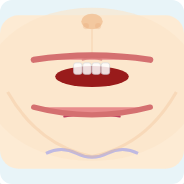

**시각 특징**: /ʌ/와 같은 viseme (편안한 입)
**개선 필요**: r 발음 시 혀 말림 표현 불가

---

#### /ɔɪ aʊ/ — Diphthongs
> Unit 22: boy, joy, toy, coin, cow, now, town...

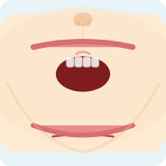

**시각 특징**: 첫 번째 음소 /ɔɪ/의 open_back viseme 표시
**개선 필요**: 이중모음의 전환 과정 표현

---

## 3. Viseme 커버리지 분석

### 3.1 15개 Viseme → 유닛 매핑

| Viseme | 입 모양 | 해당 유닛 | 음소 |
|--------|---------|----------|------|
| **open_front** | 가장 크게 벌림 | 1, 8, 22(aʊ) | æ, aɪ, aʊ |
| **mid_front** | 중간 벌림 | 2, 7, 33 | ɛ, eɪ |
| **close_front** | 넓게 당김 (웃기) | 3, 10, 11, 31 | ɪ, iː, juː |
| **open_back** | 둥근 O 크게 | 4, 20, 22(ɔɪ), 34, 35 | ɒ, ɔɪ, ɑːr, ɔːr |
| **mid_central** | 편안한 입 | 5, 21, 36 | ʌ, ɜːr |
| **close_back** | 오므린 입 | 9, 32, 37 | oʊ, uː, ʊ |
| **bilabial** | 입술 다문 | 13(bl), 14(br) | p, b, m |
| **labiodental** | 윗니↔아랫입술 | (f/v 단어에서) | f, v |
| **dental** | ★ 혀가 이빨 사이 | 19, 29 | θ, ð |
| **alveolar_stop** | 혀끝 잇몸 | (t/d/n/l 단어에서) | t, d, n, l |
| **alveolar_fric** | 이빨 맞물림 | (s/z 단어에서) | s, z |
| **postalveolar** | 입 둥글게 앞으로 | 17, 28 | ʃ, tʃ, dʒ |
| **velar** | 입 크게, 혀 뒤 | 30(ng/nk) | k, g, ŋ |
| **glottal** | 입 벌리고 숨 | (h 단어에서) | h |
| **rest** | 입 다문 대기 | 리뷰 유닛 | - |

### 3.2 동일 Viseme 공유로 인한 구분 불가 문제

| 구분 안 되는 쌍 | 공유 Viseme | 실제 차이 | 개선안 |
|----------------|-------------|----------|--------|
| /æ/ vs /aɪ/ | open_front | aɪ는 입이 줄어드는 전환 | 이중모음 화살표 추가 |
| /ɛ/ vs /eɪ/ | mid_front | eɪ는 입이 좁아지는 전환 | 이중모음 화살표 추가 |
| /ɪ/ vs /iː/ vs /juː/ | close_front | 긴장도 차이 | 입술 긴장 표시 추가 |
| /ɒ/ vs /ɑːr/ vs /ɔːr/ | open_back | r-controlled 혀 말림 | 혀 아이콘 추가 |
| /ʌ/ vs /ɜːr/ | mid_central | r-controlled 혀 말림 | 혀 아이콘 추가 |

---

## 4. 전체 단어 인벤토리 + TTS 현황

### 4.1 Core Units (1-24) — 290 단어, 오디오 100%

| Unit | Title | targetSound | Viseme | 단어 수 | 오디오 |
|------|-------|-------------|--------|---------|--------|
| 1 | Short a | æ | open_front | 20 | ✅ 100% |
| 2 | Short e | ɛ | mid_front | 17 | ✅ 100% |
| 3 | Short i | ɪ | close_front | 20 | ✅ 100% |
| 4 | Short o | ɒ | open_back | 17 | ✅ 100% |
| 5 | Short u | ʌ | mid_central | 20 | ✅ 100% |
| 6 | Review 1-5 | — | — | 0 | — |
| 7 | Long a (a_e) | eɪ | mid_front | 19 | ✅ 100% |
| 8 | Long i (i_e) | aɪ | open_front | 15 | ✅ 100% |
| 9 | Long o (o_e) | oʊ | close_back | 15 | ✅ 100% |
| 10 | Long u (u_e) | juː | close_front | 15 | ✅ 100% |
| 11 | ee/ea | iː | close_front | 15 | ✅ 100% |
| 12 | Review 7-11 | — | — | 0 | — |
| 13 | bl/cl/fl | bl cl fl | mixed | 15 | ✅ 100% |
| 14 | br/cr/dr | br cr dr | mixed | 15 | ✅ 100% |
| 15 | gr/pr/tr | gr pr tr | mixed | 15 | ✅ 100% |
| 16 | sk/sn/sp/st | sk sn sp st | mixed | 15 | ✅ 100% |
| 17 | sh/ch | ʃ tʃ | postalveolar | 20 | ✅ 100% |
| 18 | Review 13-17 | — | — | 0 | — |
| 19 | th/wh | θ ð w | dental | 15 | ✅ 100% |
| 20 | ar/or | ɑːr ɔːr | open_back | 18 | ✅ 100% |
| 21 | er/ir/ur | ɜːr | mid_central | 19 | ✅ 100% |
| 22 | Diphthongs | ɔɪ aʊ | mixed | 15 | ✅ 100% |
| 23 | Silent e Mix | — | mixed | 15 | ✅ 100% |
| 24 | Final Review | — | — | 0 | — |

### 4.2 L3 Units (25-30) — 80 단어, 오디오 48%

| Unit | Title | 단어 수 | 오디오 ✅ | 오디오 ❌ |
|------|-------|---------|----------|----------|
| 25 | l-blends | 14 | bless, glad, glow, plan, play, sled, slip, slow | black, clap, class, flag, flat, flip |
| 26 | r-blends | 14 | frog, pray | brick, bring, crab, crop, drip, drum, free, grin, grab, trip, tree, press |
| 27 | s-blends | 12 | smell, smoke, snail, sweet, swing | smile, snap, snow, stop, step, stem, swim |
| 28 | ch/sh | 14 | chick, chest, chalk, cheek, shade, shake, shed, shine | chain, check, chop, shell, shop, shut |
| 29 | th/wh | 13 | wheat, whistle | thick, thin, think, three, throne, this, that, whale, wheel, white, whip |
| 30 | ng/nk | 13 | ring, sing, king, song, long, strong, hang, bank, sink, drink, trunk, skunk, wing | (전부 있음) |

### 4.3 L4 Units (31-37) — 90 단어, 오디오 57%

| Unit | Title | 단어 수 | 오디오 ❌ (미확보) |
|------|-------|---------|------------------|
| 31 | ea/ee | 13 | dream, leaf, sheep |
| 32 | oa/ow | 13 | flow, grow |
| 33 | ai/ay | 13 | train, snail, play |
| 34 | Diphthongs | 13 | boil, coin, boy, joy, toy, cloud, cow, town |
| 35 | ar/or | 13 | car, far, star, park, dark, farm, card, corn, fork, horn, storm |
| 36 | er/ir/ur | 12 | fern, herd, bird, girl, first, stir, burn, turn, nurse, purse |
| 37 | oo sounds | 13 | spoon, broom |

### 4.4 TTS 미확보 단어 상세 목록 (81개)

> 참고: L3/L4 단어 ID는 `l3_black`, `l4_car` 형태이며, Core 단어(black.mp3, car.mp3)는 이미 존재.
> **해결 방법**: audio.ts에서 `l3_`/`l4_` prefix를 제거하고 Core 오디오 파일을 공유하면 추가 생성 없이 해결 가능.

| 난이도 | 미확보 ID | 단어 | 포함 어려운 음소 |
|--------|----------|------|-----------------|
| very_hard | l3_thick | thick | /θ/ |
| very_hard | l3_thin | thin | /θ/ |
| very_hard | l3_think | think | /θ/ |
| very_hard | l3_three | three | /θ/, /r/ |
| very_hard | l3_throne | throne | /θ/, /r/ |
| very_hard | l3_this | this | /ð/ |
| very_hard | l3_that | that | /ð/ |
| very_hard | l3_brick | brick | /r/ |
| very_hard | l3_bring | bring | /r/ |
| very_hard | l3_crab | crab | /r/ |
| very_hard | l3_crop | crop | /r/ |
| very_hard | l3_drip | drip | /r/ |
| very_hard | l3_drum | drum | /r/ |
| very_hard | l3_free | free | /f/, /r/ |
| very_hard | l3_grin | grin | /r/ |
| very_hard | l3_grab | grab | /r/ |
| very_hard | l3_trip | trip | /r/ |
| very_hard | l3_tree | tree | /r/ |
| very_hard | l3_press | press | /r/ |
| very_hard | l3_flag | flag | /f/, /l/ |
| very_hard | l3_flat | flat | /f/, /l/ |
| very_hard | l3_flip | flip | /f/, /l/ |
| very_hard | l3_black | black | /l/ |
| very_hard | l3_clap | clap | /l/ |
| very_hard | l3_class | class | /l/ |
| very_hard | l3_whale | whale | /l/ |
| very_hard | l3_wheel | wheel | /l/ |
| very_hard | l3_shell | shell | /ʃ/, /l/ |
| very_hard | l3_chain | chain | /tʃ/ |
| very_hard | l3_check | check | /tʃ/ |
| very_hard | l3_chop | chop | /tʃ/ |
| very_hard | l3_shop | shop | /ʃ/ |
| very_hard | l3_shut | shut | /ʃ/ |
| hard | l3_snap | snap | /æ/ |
| hard | l3_snow | snow | — |
| hard | l3_stop | stop | /ɒ/ |
| hard | l3_step | step | /ɛ/ |
| hard | l3_stem | stem | /ɛ/ |
| hard | l3_swim | swim | /ɪ/ |
| hard | l3_smile | smile | /aɪ/, /l/ |
| hard | l3_white | white | /aɪ/ |
| hard | l3_whip | whip | /ɪ/ |
| — | l4_dream | dream | /r/ |
| — | l4_leaf | leaf | /l/, /f/ |
| — | l4_sheep | sheep | /ʃ/ |
| — | l4_flow | flow | /f/, /l/ |
| — | l4_grow | grow | /r/ |
| — | l4_train | train | /r/ |
| — | l4_snail | snail | /l/ |
| — | l4_play | play | /l/ |
| — | l4_boil | boil | /l/ |
| — | l4_coin | coin | — |
| — | l4_boy | boy | — |
| — | l4_joy | joy | — |
| — | l4_toy | toy | — |
| — | l4_cloud | cloud | /l/ |
| — | l4_cow | cow | — |
| — | l4_town | town | — |
| — | l4_car | car | — |
| — | l4_far | far | /f/ |
| — | l4_star | star | /r/ |
| — | l4_park | park | — |
| — | l4_dark | dark | — |
| — | l4_farm | farm | /f/ |
| — | l4_card | card | — |
| — | l4_corn | corn | — |
| — | l4_fork | fork | /f/ |
| — | l4_horn | horn | — |
| — | l4_storm | storm | /r/ |
| — | l4_fern | fern | /f/ |
| — | l4_herd | herd | — |
| — | l4_bird | bird | — |
| — | l4_girl | girl | /l/ |
| — | l4_first | first | /f/ |
| — | l4_stir | stir | /r/ |
| — | l4_burn | burn | — |
| — | l4_turn | turn | — |
| — | l4_nurse | nurse | — |
| — | l4_purse | purse | — |
| — | l4_spoon | spoon | — |
| — | l4_broom | broom | /r/ |

---

## 5. 한국 학생 난이도별 음소 분류

### 5.1 Very Hard (한국어에 없는 소리) — 7개

| 음소 | IPA | 입모양 핵심 | 현재 Viseme | 입모양 정확도 |
|------|-----|-----------|-------------|-------------|
| /θ/ | th voiceless | **혀가 이빨 사이로 보임** | dental ✅ | ⭐⭐⭐⭐⭐ 정확 |
| /ð/ | th voiced | 혀 이빨 사이 + 진동 | dental ✅ | ⭐⭐⭐⭐ (진동 표시 있음) |
| /r/ | r | 혀 말림, 아무데도 안 닿음 | postalveolar ⚠️ | ⭐⭐ (혀 말림 표현 불가) |
| /l/ | l | 혀끝이 잇몸 접촉 | alveolar_stop ⚠️ | ⭐⭐⭐ (접촉 표현 부족) |
| /f/ | f | **윗니가 아랫입술 위** | labiodental ✅ | ⭐⭐⭐⭐⭐ 정확 |
| /v/ | v | 윗니 아랫입술 + 진동 | labiodental ✅ | ⭐⭐⭐⭐ |
| /z/ | z | 이빨 맞물림 + 진동 | alveolar_fric ✅ | ⭐⭐⭐⭐ |

### 5.2 Hard (비슷하지만 다른 소리) — 6개

| 음소 | 핵심 혼동 | 현재 Viseme | 개선 필요 |
|------|---------|-------------|----------|
| /æ/ (cat) | /ɛ/와 혼동 | open_front ✅ | /ɛ/와 비교 가능하게 |
| /ɛ/ (bed) | /æ/와 혼동 | mid_front ✅ | 턱 높이 차이 강조 |
| /ɪ/ (sit) | /iː/와 혼동 | close_front ✅ | 긴장도 차이 표현 |
| /ɒ/ (hot) | 한국어 "오"와 다름 | open_back ✅ | 둥근 입 강조 |
| /ʌ/ (cup) | "어"로 대체 경향 | mid_central ✅ | 편안한 입 강조 |
| /eɪ/ (cake) | 이중모음 전환 | mid_front ⚠️ | /ɛ/와 동일 viseme |

### 5.3 Moderate — 5개

| 음소 | Viseme | 특기사항 |
|------|--------|---------|
| /ʃ/ (sh) | postalveolar ✅ | 둥근 입 잘 표현됨 |
| /tʃ/ (ch) | postalveolar ✅ | /ʃ/와 같은 viseme |
| /aɪ/ (bike) | open_front ⚠️ | /æ/와 동일 viseme |
| /oʊ/ (bone) | close_back ✅ | 오므린 입 잘 표현됨 |
| /aʊ/ (cow) | open_front ⚠️ | /æ/와 동일 viseme |

---

## 6. 개선 계획

### 6.1 우선순위 1: 즉시 해결 가능 (코드 수정만)

| # | 항목 | 설명 | 난이도 |
|---|------|------|--------|
| A1 | L3/L4 오디오 공유 | `l3_black` → `black.mp3` fallback 로직 추가 (audio.ts) | 낮음 |
| A2 | 복합 targetSound 완전 처리 | blend 유닛(13-16)의 입모양 — 현재 첫 음소만 | 낮음 |
| A3 | /r/ vs /l/ 시각 차별화 | /r/은 postalveolar, /l/은 alveolar_stop → 혀 위치 힌트 텍스트 추가 | 중간 |

### 6.2 우선순위 2: 중기 개선 (새 기능)

| # | 항목 | 설명 | 난이도 |
|---|------|------|--------|
| B1 | 이중모음 전환 표시 | /eɪ/, /aɪ/, /oʊ/, /aʊ/, /ɔɪ/ — 시작→끝 화살표 표시 | 중간 |
| B2 | 혼동 쌍 비교 모드 | /æ/ vs /ɛ/, /r/ vs /l/, /f/ vs /p/ 나란히 | 높음 |
| B3 | r-controlled 혀 아이콘 | /ɑːr/, /ɔːr/, /ɜːr/ — 혀 말림 시각 표시 | 중간 |
| B4 | voiced/voiceless 쌍 강조 | /θ/ vs /ð/, /f/ vs /v/, /s/ vs /z/ — 진동 차이 | 낮음 |

### 6.3 우선순위 3: 장기 (에셋 제작 필요)

| # | 항목 | 설명 | 비용 |
|---|------|------|------|
| C1 | Lottie 고품질 입모양 | very_hard 7개 음소 After Effects 작업 | AE 필요 |
| C2 | AI 립싱크 비디오 | VEED Fabric으로 109개 단어 영상 | ~$17 |
| C3 | 실제 사람 사진 | 각 viseme별 실제 입 클로즈업 촬영 | 촬영 필요 |

---

## 7. 현재 입모양 정확도 평가 요약

| 등급 | 음소 | Viseme 정확도 | 개선 필요 |
|------|------|-------------|----------|
| ⭐⭐⭐⭐⭐ 완벽 | /θ/, /ð/ (dental) | 혀 돌출 정확 | — |
| ⭐⭐⭐⭐⭐ 완벽 | /f/, /v/ (labiodental) | 윗니↔입술 정확 | — |
| ⭐⭐⭐⭐ 좋음 | /æ/, /ɛ/, /ɒ/, /ʌ/, /ɪ/ (모음) | 벌림 차이 표현됨 | 비교 모드 추가하면 더 좋음 |
| ⭐⭐⭐⭐ 좋음 | /ʃ/, /tʃ/ (postalveolar) | 둥근 입 표현 | 공기 흐름 있음 |
| ⭐⭐⭐⭐ 좋음 | /oʊ/, /uː/ (close_back) | 오므린 입 | — |
| ⭐⭐⭐ 보통 | /s/, /z/ (alveolar_fric) | 이빨 맞물림 | 유무성 차이 강조 필요 |
| ⭐⭐ 미흡 | /r/ | postalveolar로 매핑 — 혀 말림 안 보임 | 전용 viseme 또는 힌트 필요 |
| ⭐⭐ 미흡 | /eɪ/, /aɪ/, /aʊ/ (이중모음) | 단모음과 동일 viseme | 전환 표시 필요 |

---

## 부록: 파일 참조

| 파일 | 용도 |
|------|------|
| `src/app/lesson/[unitId]/HumanMouthCharacter.tsx` | 입 클로즈업 SVG (15 viseme) |
| `src/app/lesson/[unitId]/MouthVisualizer.tsx` | 래퍼 컴포넌트 |
| `src/app/lesson/[unitId]/MouthCrossSection.tsx` | 단면도 (현재 미사용, 토글 가능) |
| `src/data/visemeMap.ts` | 44 음소 → 15 viseme 매핑 |
| `src/data/pronunciationGuide.ts` | 21개 음소 교육 데이터 |
| `src/data/curriculum.ts` | Core 24유닛 단어 데이터 |
| `src/data/l3l4Words.ts` | L3/L4 13유닛 단어 데이터 |
| `src/data/representativeWords.ts` | 립싱크 비디오 카탈로그 |
| `public/assets/audio/` | 735개 TTS MP3 파일 |
| `docs/pronunciation-qa/mouth-*.png` | 본 문서 참조 이미지 (16장) |
