# Phonics 300 - 학생용 이용 가이드

> **소리로 읽는 영어 300** - 초등학생을 위한 파닉스 학습 앱

---

## 1. 앱 시작하기 (앱 활성화)

앱을 처음 열면 **앱 활성화** 화면이 나타납니다.

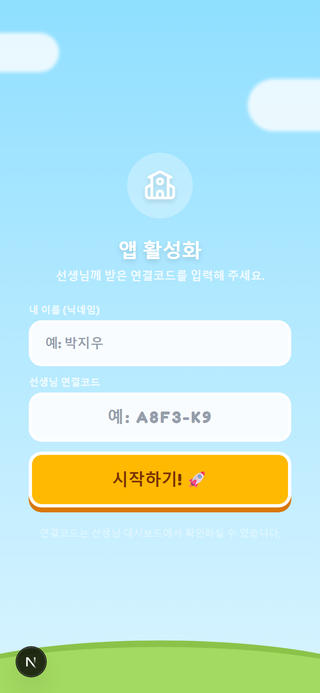

### 이렇게 해요:
1. **내 이름 (닉네임)** 칸에 이름을 입력해요 (예: 박지우)
2. **선생님 연결코드** 칸에 선생님이 알려준 코드를 입력해요 (예: A8F3-K9)
3. **"시작하기!"** 버튼을 눌러요

> **중요 포인트**: 연결코드는 선생님께서 알려주신 코드예요. 모르겠으면 선생님께 여쭤보세요!

---

## 2. 유닛 선택하기

활성화가 끝나면 **유닛 선택** 화면으로 이동합니다.

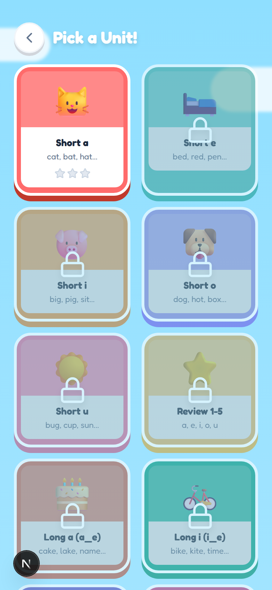

### 이렇게 해요:
- 색깔 카드를 눌러서 배울 유닛을 선택해요
- 자물쇠가 있는 유닛은 아직 잠겨 있어요 - 앞 유닛을 먼저 완료하면 열려요!
- 별(★)은 유닛 완료도를 보여줘요

### 유닛 구성 (24개):
| 유닛 | 주제 | 예시 단어 |
|------|------|----------|
| 1~5 | 짧은 모음 (Short Vowels) | cat, bed, pig, dog, bug |
| 6 | 복습 1~5 | 모음 총정리 |
| 7~11 | 긴 모음 (Long Vowels / Magic e) | cake, bike, rope |
| 12 | 복습 7~11 | 긴 모음 총정리 |
| 13~17 | 자음 조합 (Blends & Digraphs) | ship, chat, block |
| 18 | 복습 13~17 | 자음 조합 총정리 |
| 19~23 | 고급 패턴 (R-controlled, Diphthongs) | bird, cloud, boy |
| 24 | 최종 복습 | 전체 총정리 |

---

## 3. 레슨 진행하기 (약 10분)

유닛을 선택하면 **레슨**이 시작됩니다. 하나의 레슨은 여러 단계(스텝)로 구성되어 있어요.
화면 위쪽의 **진행 바**와 **숫자**(예: 2/8)로 지금 어디쯤인지 알 수 있어요.

---

### Step 1: Sound Focus (소리 집중)

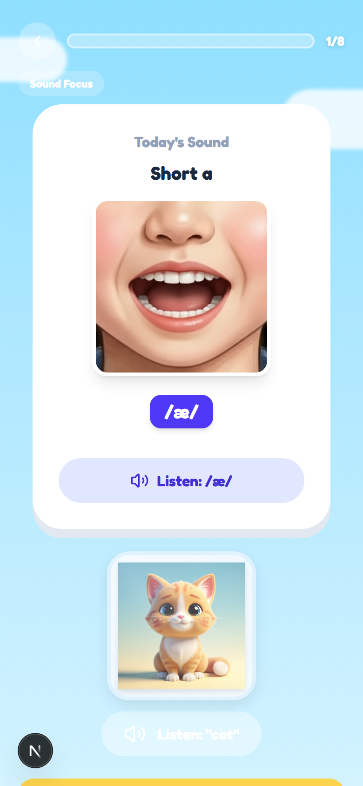

**무엇을 하나요?**
오늘 배울 소리를 듣고 입 모양을 관찰해요.

**이렇게 해요:**
1. 화면의 **입 모양 사진**을 보면서 소리가 어떻게 나는지 확인해요
2. **/æ/** 같은 발음 기호를 눌러서 소리를 들어요
3. **"Listen: /æ/"** 버튼을 눌러 다시 들을 수 있어요
4. 아래의 단어 카드(예: cat)를 눌러서 단어 발음도 들어봐요

> **중요 포인트**: 입 모양을 잘 보고 따라해 보세요! 소리를 여러 번 들으면 더 잘 기억돼요.

---

### Step 2: Blend & Tap (소리 합치기)

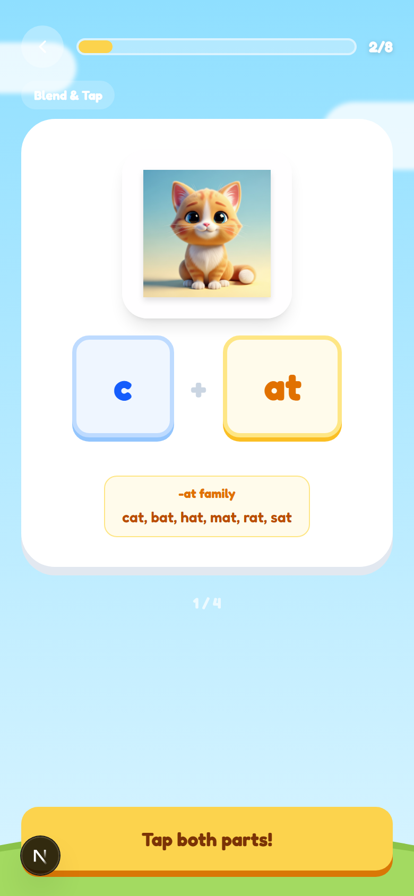

**무엇을 하나요?**
글자를 하나씩 탭하면서 소리를 합쳐 단어를 만들어요.

**이렇게 해요:**
1. 그림을 보고 어떤 단어인지 생각해요
2. 왼쪽 글자(**c**)와 오른쪽 글자(**at**)를 각각 탭해요
3. 두 소리가 합쳐져서 **"cat"** 이 돼요!
4. 아래에 같은 패턴의 단어들(-at family)이 보여요

> **중요 포인트**: "Tap both parts!" 가 나오면 두 부분을 모두 눌러야 해요. c + at = cat!

---

### Step 3: Decode Words (단어 해독)

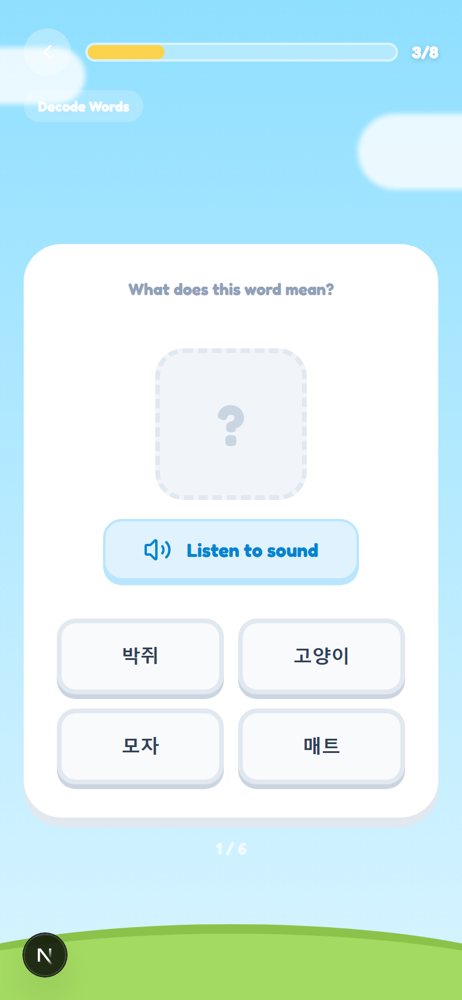

**무엇을 하나요?**
소리를 듣고 올바른 뜻(한국어)을 골라요.

**이렇게 해요:**
1. **"Listen to sound"** 버튼을 눌러서 영어 단어를 들어요
2. 4개의 한국어 뜻 중에서 맞는 것을 골라요
3. 맞추면 다음 문제로 넘어가요!

> **중요 포인트**: 잘 모르겠으면 소리를 여러 번 다시 들어보세요. 틀려도 괜찮아요 - 배우는 과정이에요!

---

### Step 4: Word Family Builder (단어 가족 만들기)

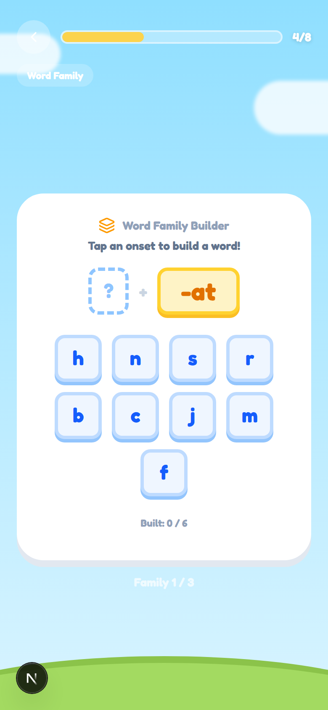

**무엇을 하나요?**
같은 끝소리(-at, -an, -ap 등)를 가진 단어들을 만들어요.

**이렇게 해요:**
1. 오른쪽의 노란 박스에 고정된 끝소리(예: **-at**)를 확인해요
2. 아래 글자 버튼(h, n, s, r, b, c, j, m, f)을 하나 골라요
3. 선택한 글자 + 끝소리를 합쳐서 진짜 단어가 되면 정답!
4. 예: **c** + **-at** = **cat** (정답!), **j** + **-at** = **jat** (없는 단어!)

> **중요 포인트**: "Built: 0/6" 숫자가 올라가도록 모든 단어를 찾아보세요! Family 1/3은 3개의 단어 가족이 있다는 뜻이에요.

---

### Step 5: Say & Check (말하고 확인하기)

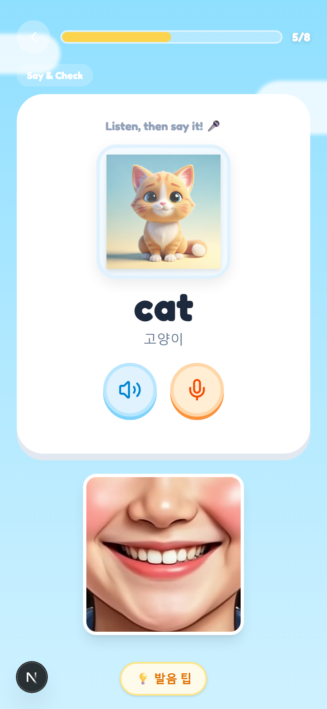

**무엇을 하나요?**
단어를 직접 소리 내어 말하고, 발음을 확인해요.

**이렇게 해요:**
1. 그림과 단어를 보고 어떻게 읽는지 생각해요
2. **스피커 버튼**을 눌러서 정확한 발음을 들어요
3. **마이크 버튼**을 눌러서 직접 따라 말해봐요
4. 아래 **입 모양 사진**을 보면서 입 모양을 따라해요
5. **"발음 팁"** 버튼을 누르면 발음 힌트를 볼 수 있어요

> **중요 포인트**: 부끄러워하지 마세요! 큰 소리로 따라 말하면 발음이 더 빨리 좋아져요.

---

### Step 6: Micro Reader (짧은 글 읽기)

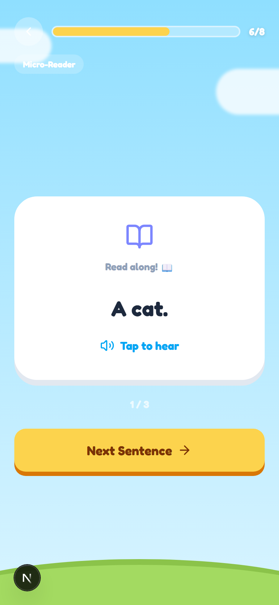

**무엇을 하나요?**
배운 단어가 들어간 짧은 문장을 읽어요.

**이렇게 해요:**
1. 화면의 문장을 읽어봐요 (예: "A cat.")
2. **"Tap to hear"** 를 눌러서 문장 발음을 들어요
3. **"Next Sentence"** 를 눌러 다음 문장으로 넘어가요

> **중요 포인트**: 1/3 표시를 보면서 총 몇 개의 문장이 있는지 확인해요. 혼자 읽어본 다음 소리를 들어보세요!

---

### Step 7: Story Time (이야기 시간)

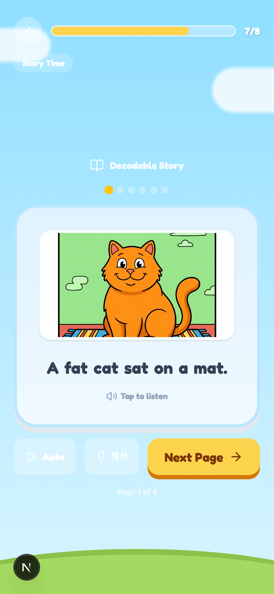

**무엇을 하나요?**
배운 단어로 만든 재미있는 이야기를 만화처럼 읽어요.

**이렇게 해요:**
1. 그림과 문장을 함께 읽어요 (예: "A fat cat sat on a mat.")
2. **"Tap to listen"** 을 눌러서 문장 발음을 들어요
3. **"Auto"** 버튼: 자동으로 넘어가면서 들을 수 있어요
4. **"해석"** 버튼: 한국어 뜻을 볼 수 있어요
5. **"Next Page"** 를 눌러 다음 페이지로!

> **중요 포인트**: 그림을 보면서 이야기를 상상하면 더 재미있어요! 모든 유닛에 이야기가 있는 건 아니에요.

---

### Step 8: Exit Ticket (마무리 퀴즈)

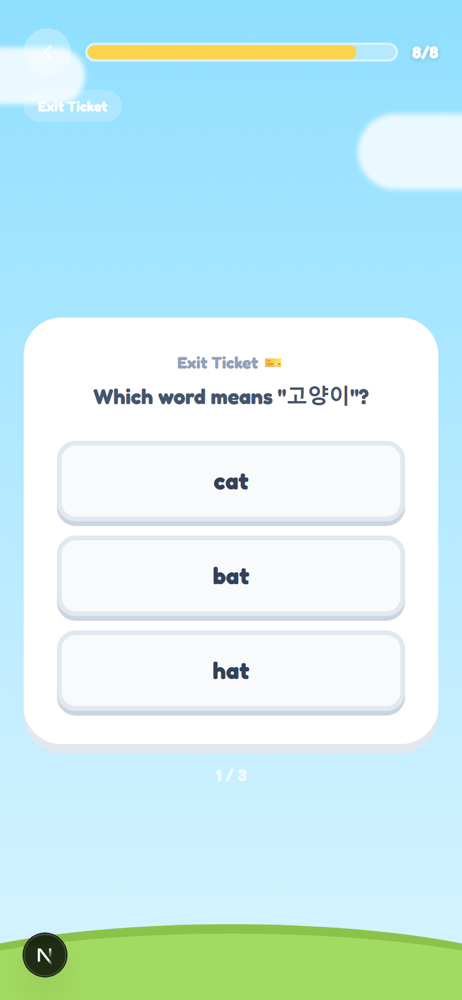

**무엇을 하나요?**
오늘 배운 내용을 확인하는 마지막 퀴즈예요.

**이렇게 해요:**
1. 한국어 뜻을 보고 (예: "고양이") 맞는 영어 단어를 골라요
2. 3개의 보기 중에서 정답을 선택해요
3. 총 3문제를 풀어요 (1/3 → 2/3 → 3/3)

> **중요 포인트**: 이 퀴즈 결과가 학습 기록에 저장돼요. 집중해서 풀어보세요!

---

## 4. 복습하기 (Review)

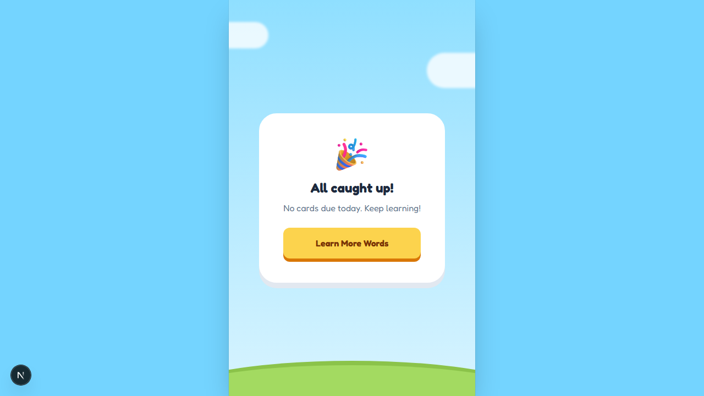

홈 화면에서 **"복습"** 버튼을 누르면 복습 카드가 나와요.

### 이렇게 해요:
- 이전에 배운 단어들이 카드로 나타나요
- 기억이 잘 나는 단어는 자동으로 덜 나오고, 어려운 단어는 더 자주 나와요
- **"All caught up!"** 이 보이면 오늘 복습할 단어가 없다는 뜻이에요

> **중요 포인트**: 매일 조금씩 복습하면 단어를 오래 기억할 수 있어요!

---

## 5. 나의 트로피 (Rewards)

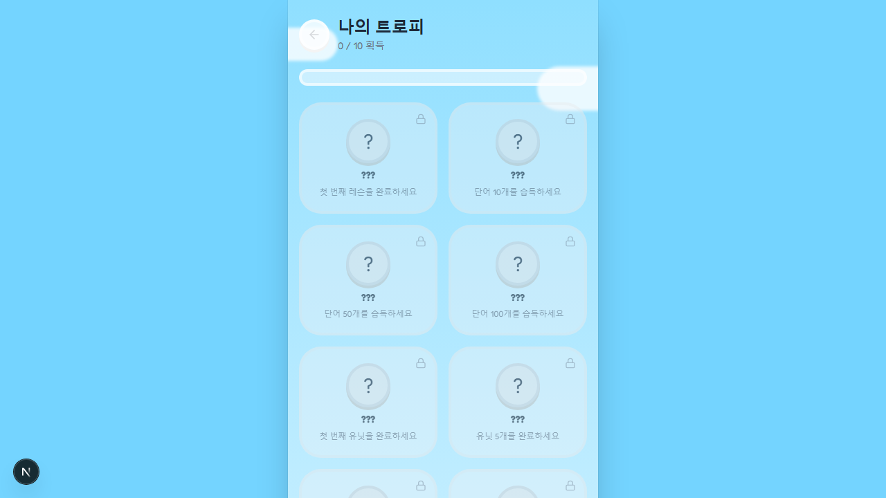

열심히 학습하면 **트로피**를 모을 수 있어요!

### 트로피 종류:
| 트로피 | 조건 |
|--------|------|
| ??? | 첫 번째 레슨을 완료하세요 |
| ??? | 단어 10개를 습득하세요 |
| ??? | 단어 50개를 습득하세요 |
| ??? | 단어 100개를 습득하세요 |
| ??? | 첫 번째 유닛을 완료하세요 |
| ??? | 유닛 5개를 완료하세요 |
| ... | 더 많은 트로피가 숨겨져 있어요! |

> **중요 포인트**: 트로피는 총 10개! 이름은 직접 획득해야 알 수 있어요. 0/10에서 10/10을 목표로!

---

## 6. 학습 리포트 (Report)

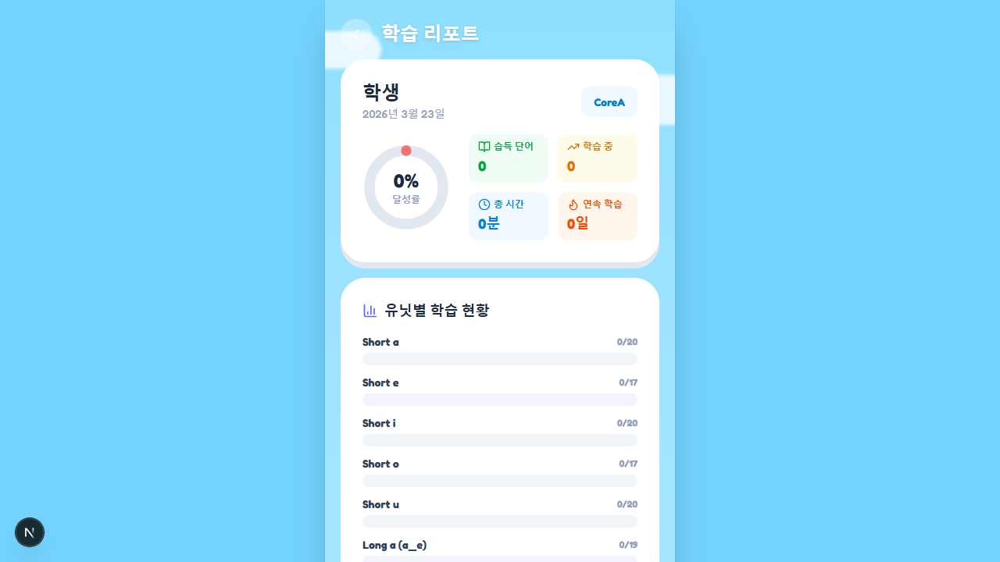

**리포트** 페이지에서 나의 학습 기록을 확인할 수 있어요.

### 확인할 수 있는 것:
- 완료한 유닛 수
- 습득한 단어 수
- 학습 시간
- CSV/PDF로 내보내기 가능 (선생님께 보여드릴 때 유용!)

---

## 7. 설정 (Settings)

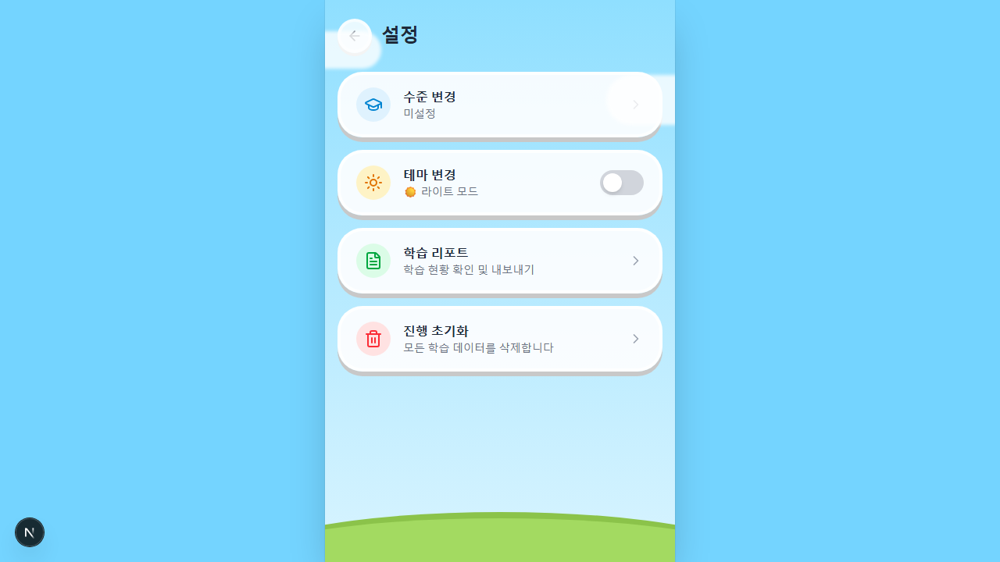

**설정** 페이지에서 앱을 관리할 수 있어요.

### 설정 항목:
- **학년 변경**: 내 학년을 바꿀 수 있어요
- **데이터 초기화**: 처음부터 다시 시작할 수 있어요 (주의!)
- **버전 정보**: 앱 버전을 확인할 수 있어요

---

## 꿀팁 모음

1. **매일 10분!** 하루에 한 유닛씩, 매일 꾸준히 하는 게 가장 중요해요
2. **소리를 크게!** 듣기만 하지 말고, 큰 소리로 따라 읽어보세요
3. **복습은 필수!** 홈 화면의 복습 버튼을 매일 확인해요
4. **틀려도 괜찮아요!** 틀린 단어는 복습에 자동으로 추가돼요
5. **트로피를 모아요!** 10개 트로피를 모두 모으는 것을 목표로 해봐요

---

*Phonics 300 - 소리로 읽는 영어 300 | 학생용 이용 가이드 v1.0*
