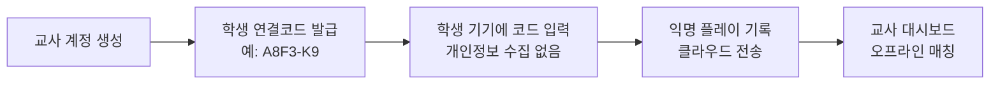
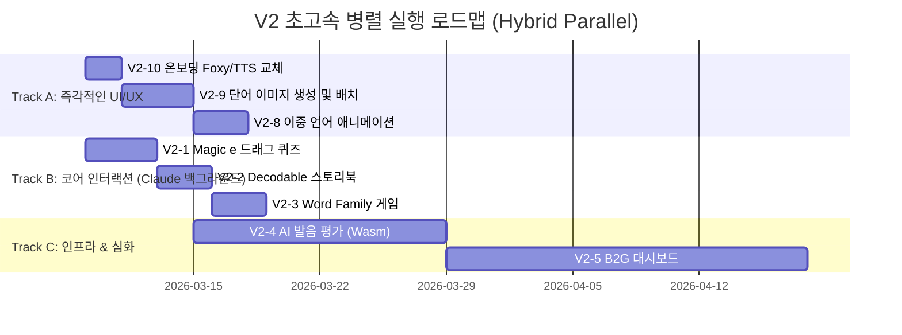

# Phonics 300 — V2 실행 계획서

> MVP 이후 주요 기능 고도화 + 교수법 반영 전체 로드맵

---

## V2 마일스톤 개요

| Phase | 주제 | 핵심 내용 | 예상 소요 | R&R |
|:-----:|------|----------|:---------:|:---:|
| V2-1 | Magic e 전용 인터랙션 | CVC→CVCe 드래그 게임 + Read and Compare | 3~4일 | 하이브리드 |
| V2-2 | Decodable Stories 확장 | Micro-Reader를 5~8문장 스토리 모드로 강화 | 2~3일 | 하이브리드 |
| V2-3 | Word Family Builder 게임 | Rime 고정 → Onset 선택 신규 미니게임 | 2~3일 | 하이브리드 |
| V2-4 | AI 발음 평가 고도화 | DTW/MFCC 기반 계량적 발음 점수 (Wasm) | 2~3주 | 하이브리드 |
| V2-5 | B2G 대시보드 & 클라우드 동기화 | 교사 계정, 익명 학생 연결코드, 실시간 진도 관리 | 3~4주 | 하이브리드 |
| V2-6 | 리포트 고도화 & 내보내기 | 취약 음소 차트, PDF/CSV 내보내기 | 1~2주 | 하이브리드 |
| V2-7 | L3/L4 커리큘럼 확장 | 자음군/이중자음(SP4) + 이중모음/R통제(SP5) 유닛 추가 | 2~3주 | 하이브리드 |
| V2-8 | 홈 화면 고도화 & 이중 언어 음성 | 마스코트 영어+한국어 이중 나레이션 및 맞춤형 캐릭터 애니메이션 | 3~5일 | 하이브리드 |
| V2-9 | 시각적 단어 학습 (Word Images) | 300개 단어 이미지 사전 생성을 통한 학습 시각 자료 보강 | 3~5일 | 하이브리드 |
| V2-10 | 온보딩 UI 및 TTS 전면 교체 | 3D Foxy 이미지 교체, 자연스러운 ElevenLabs Solo 음성 적용 | 1~2일 | 하이브리드 |

## 🚀 V2 초고속 병렬 실행 전략 (Accelerated Parallel Execution)
가장 빠르게 V2를 완성하기 위해, 백그라운드 모델(Claude Code/스크립트)과 제가(Antigravity) **동시다발적(Parallel)으로 임무를 수행**합니다. 
진행 우선순위는 다음과 같이 "시각과 음향의 즉각적 개선(V2-10, V2-9)"부터 시작하여 "핵심 학습 모듈(V2-1~3)"로 확장합니다.

---

## V2-1: Magic e 전용 인터랙션 (우선순위 7)

### 목표
Unit 7~10, 23에서 "Silent e가 붙으면 모음 소리가 바뀐다"를 **체험 학습**하게 하는 드래그 인터랙션 구현

### 구현 상세

#### [Antigravity 담당]
- Magic e 드래그 인터랙션 UI 디자인 및 에셋 제작
- CVC→CVCe 이미지 페어 (cap→cape 모자→망토, kit→kite 등) 생성
- E2E 브라우저 테스트

#### [Claude Code 담당]
- `MagicEStep` 신규 React 컴포넌트 개발:
  ```
  화면: "cap" [모자 이미지]
  하단에 떠다니는 [e] 타일
  아이가 e를 cap 끝에 드래그 → "cape" [망토 이미지]
  TTS: /kæp/ → /keɪp/ 소리 변화 재생
  ```
- "Read and Compare" 퀴즈 모드: 두 단어를 나란히 표시하고 음성 재생 → 올바른 단어/이미지 터치
- `phonics300_upgrade_data.json` > `minimal_pairs` > short vs long 데이터 활용

---

## V2-2: Decodable Stories 확장 (우선순위 8)

### 목표
현재 3문장짜리 Micro-Reader를 **5~8문장 만화 스토리 모드**로 확장

### 구현 상세

#### [Antigravity 담당]
- 만화 패널 형식 UI/UX 디자인 (말풍선, 캐릭터 배치)
- 스토리별 일러스트 에셋 생성 (AI 이미지 생성 활용)

#### [Claude Code 담당]
- `StoryReaderStep` 신규 React 컴포넌트 개발
- `phonics300_upgrade_data.json` > `extended_stories` 데이터를 소스로 활용
- 만화 패널 슬라이드 + 문장별 하이라이트 + TTS 자동 재생 연동
- 유닛 레슨 플로우에 Step 5로 삽입 (Micro-Reader 다음, Exit Ticket 전)

### 데이터 (이미 준비됨)
- unit_01: "The Fat Cat" (7문장)
- unit_04: "The Hot Dog" (5문장)
- unit_07: "Kate's Cake" (6문장)
- unit_08: "Mike's Kite" (6문장)
- 추가 유닛 스토리는 AI 생성으로 확장

---

## V2-3: Word Family Builder 게임

### 목표
Rime을 고정하고 Onset만 바꿔서 여러 단어를 빠르게 만드는 미니게임

### 구현 상세
```
[화면 구성]
Rime 고정: [-at]
Onset 선택지: [b] [c] [h] [m] [r] [s]
→ 터치하면: bat, cat, hat, mat, rat, sat 순차 완성
→ 각 단어 이미지가 카드처럼 쌓이는 애니메이션
→ 모든 onset을 다 터치하면 "Word Family 완성!" 축하 효과
```

- `curriculum.ts`의 `wordFamily` 필드를 그룹핑 키로 활용
- `phonics300_업그레이드_데이터.md` 섹션 5의 `wordFamiliesByUnit` 데이터 활용

---

## V2-4: AI 발음 평가 엔진 고도화

### 목표
브라우저 STT의 단순 텍스트 매칭을 넘어, "원어민 대비 발음 일치도 85점" 같은 계량적 점수 제공

### 기술 스택
- Web Audio API로 마이크 입력 캡처
- MFCC(Mel-Frequency Cepstral Coefficients) 특징 추출
- DTW(Dynamic Time Warping) 알고리즘으로 기준 발음과 학습자 발음 비교
- WebAssembly(Wasm) 기반 경량 추론 모듈

### 하이브리드 R&R
| 역할 | 작업 |
|------|------|
| Antigravity | Web Audio API 구조 분석, 파형 비교 파라미터 문서화, 녹음 QA |
| Claude Code | Wasm 오디오 분석 모듈 이식, 점수화 알고리즘 구현, 프로그레스 게이지 UI |

---

## V2-5: B2G 대시보드 & 클라우드 동기화

### 목표
교사가 학생 수십 명의 학습 진도를 실시간 관리하는 통합 대시보드

### 핵심 아키텍처: 익명 연동(Anonymous Link)



### 하이브리드 R&R
| 역할 | 작업 |
|------|------|
| Antigravity | 클라우드 서비스(Supabase) 아키텍처 설계, DB 스키마, 대시보드 UI 기획 및 E2E 테스트 |
| Claude Code | SDK 연동, IndexedDB↔클라우드 Sync 로직, JWT 인증, Recharts 차트 UI |

---

## V2-6: 리포트 고도화 & 내보내기

### 목표
학부모 전달용 심층 리포트 생성 및 PDF/CSV 내보내기

### 구현 내용
- 취약 음소(Phoneme) 통계 차트 (Recharts)
- 주간/월간 리포트 자동 생성
- PDF 내보내기 (`jspdf` + `html2canvas`)
- CSV 데이터 내보내기 (알림장 공유용)

---

## V2-7: L3/L4 커리큘럼 확장

### 목표
Smart Phonics 4~5, Fast Phonics Unit 9~12 기반 심화 커리큘럼 추가

### L3: 자음군 & 이중자음 (6유닛, ~80단어)
- L3-1: l-blends (bl, cl, fl, gl, pl, sl)
- L3-2: r-blends (br, cr, dr, fr, gr, pr, tr)
- L3-3: s-blends (sm, sn, st, sw)
- L3-4: ch, sh
- L3-5: th, wh
- L3-6: ng, nk

### L4: 이중모음 & R통제모음 (7유닛, ~90단어)
- L4-1: ea, ee
- L4-2: oa, ow (long)
- L4-3: ai, ay
- L4-4: oi, oy, ou, ow (diphthongs)
- L4-5: ar, or
- L4-6: er, ir, ur
- L4-7: oo (short/long)

> 모든 단어 데이터는 `textbook_data.json`에 이미 준비됨

---

## V2-8: 홈 화면 고도화 & 이중 언어 음성 (Bilingual Narration)

### 목표
유저 경험(UX) 극대화를 위해 앱 진입 시 마스코트(Foxy)가 영어와 한국어를 혼합하여 환영 인사를 건네고, 이에 맞는 입모양/동작 애니메이션을 적용합니다.

### 구현 상세
- **음성 연결 (Audio Sequencing)**: "Hi I'm Foxy!" (영어) 재생 직후 "안녕! 나는 폭시야! 같이 파닉스를 배워보자!" (한국어) 음성이 지연 없이 자연스럽게 이어지도록 `<audio>` 태그의 `onEnded` 이벤트를 확장하거나 오디오 버퍼를 병합(Stitching)
- **비주얼 동기화 (Visual Sync)**: 음성 파형에 맞춘 Foxy 캐릭터의 입모양 애니메이션 (Blinking, Talking 모드) 추가
- **하이브리드 R&R**: 
  - [Antigravity 담당] Foxy 캐릭터 Idle / Talking 애니메이션 에셋(SVG/Lottie) 준비 및 VQA
  - [Claude Code 담당] 오디오 시퀀서 구현 및 애니메이션 상태(Zustand/React state) 연동

---

## V2-9: 시각적 단어 학습 (Word Images)

### 목표
파닉스를 처음 접하는 아이들이 단어의 뜻을 "그림(Image)"으로 직관적으로 연상하여 학습 효과를 극대화.

### 구현 상세
- **에셋 생성**: 앱 내 300단어에 대해 아이들이 좋아할 만한 고품질 일러스트/3D 에셋(나노바나나프로 등 이미지 생성형 AI 활용) 일괄 제작
- **위치 배치**: `BlendTapStep` (단어 카드 병합 후 축하 화면) 및 `SoundFocus` 등 단어 의미 학습 구간에 이미지가 부드럽게 팝업(Scale-in)되도록 인터페이스 개편
- **진행 방식**: 스크립트로 300개 프롬프트 자동화 → 단어 이미지 에셋 폴더 구축 → 리액트 컴포넌트(`LessonClient.tsx`)에 이미지 태그 주입

---

## V2-10: 온보딩 UI 및 TTS 전면 교체

### 목표
사용자님의 요청에 따라 첫 진입 화면의 여우 캐릭터를 완전히 시각적으로 교체하고, 다소 어색했던 한국어 안내 음성을 최고 품질로 업그레이드.

### 구현 상세
- **3D Foxy 교체**: 첨부해주신 입체적이고 귀여운 여우 캐릭터(목도리 착용) 이미지로 온보딩 로그인 화면 마스코트 전면 교체 (`src/app/onboarding/page.tsx` 내부 SVG/기존 이미지 교체)
- **자연스러운 한국어 안내**: "학습수준을 선택해주세요" 라는 어색한 문장을 좀 더 친근한 문구("어떤 레벨로 시작할까요?" 등)로 변경
- **ElevenLabs V3(Solo)**: 해당 안내 음성을 ElevenLabs v3 모델 + `Solo` 보이스 조합으로 생성하여 거부감 없고 자연스러운 음성 파일로 대체

---

## 초고속 실행 로드맵 (Parallel Timeline)



---

## 💡 하이브리드 개발 상세 체크리스트 (Claude Code & Antigravity 인계용)

본 체크리스트는 사용자, Antigravity(시각/인프라/QA), Claude Code(내부 구조/로직)가 완벽히 분업하여 V2를 완성하기 위한 구체적인 작업 지시서입니다. Claude Code에게 특정 작업을 지시할 때 이 섹션을 활용하세요.

### [Track A] 즉각적인 UI/UX 업그레이드

> **🔥 터미널 병렬 실행 전략 (Parallel Execution Strategy)**
> - Step 1: `V2-10` (온보딩 및 TTS 교체)는 이미 완료되었습니다.
> - Step 2: `V2-9`의 에셋 생성 스크립트는 백그라운드에서 구동 중입니다.
> - Step 3: Claude Code를 2개의 병렬 터미널로 나누어 작업을 지시하세요.
>   - **[터미널 A]**: `V2-8` (이중 언어 오디오 시퀀서 및 홈 화면 로직) 전담
>   - **[터미널 B]**: `V2-9` (단어 3D 이미지를 앱 요소 곳곳에 배치하는 뷰 로직) 전담
> - **[중요] BKIT 보고서 산출**: 각 작업(V2-8, V2-9)의 완료 시점에는 반드시 `docs/03-analysis/features/v2-X.analysis.md` (Gap 분석)과 `docs/04-report/features/v2-X.report.md` (완료 보고서)를 산출 문서로 작성해야 합니다.

#### V2-10: 온보딩 UI 및 TTS 전면 교체 (✅ 완료)
- [x] **[Antigravity]** 3D Foxy 에셋 교체 및 VQA 검수 완료
- [x] **[Claude Code]** `src/app/onboarding/page.tsx` 내부 텍스트 수정 및 ElevenLabs V3(Solo) 통합 완료

#### V2-9: 시각적 단어 학습 (Word Images) UI 연동
- [x] **[Antigravity]** 300단어에 대한 3D 이미지 에셋 생성 스크립트 작성 및 백그라운드 구동 완료 (`public/assets/images/` 적재 완료)
- [x] **[Claude Code]** `src/app/lesson/[unitId]/LessonClient.tsx`의 `BlendTapStep` 등 단어 의미를 배우는 핵심 구간에 생성된 이미지를 부드럽게 팝업(Scale-in)되도록 UI 개편 (Framer Motion 활용)
- [x] **[Claude Code]** 이미지가 없을 경우(예기치 못한 404)를 대비한 Fallback UI(예: 기존 글자만 표시) 안전장치 로직 작성

#### V2-8: 홈 화면 고도화 & 이중 언어 음성 (Bilingual Narration)
- [x] **[Antigravity]** Foxy 캐릭터의 Idle, Talking 상태 애니메이션 에셋(SVG) 교체 완료 (`public/assets/foxy-idle.svg`, `foxy-talking.svg`)
- [x] **[Claude Code]** `src/app/page.tsx` 및 관련 오디오 훅을 수정하여 영어 인사말 직후 한국어 인사말이 지연 없이 재생되는 오디오 시퀀서 로직 구현
- [x] **[Claude Code]** 음성 재생 상태(재생 중/대기 중)에 따라 Foxy 애니메이션 상태를 제어하는 Zustand 또는 로컬 State 연동 로직 작성

---

### [Track B] 코어 인터랙션 게임화

#### V2-1: Magic e 전용 인터랙션
- [ ] **[Antigravity]** CVC 및 CVCe 단어 페어(예: cap/cape, kit/kite) 이미지 에셋 제작 및 `public/assets/images` 배치
- [ ] **[Claude Code]** `src/app/lesson/[unitId]/MagicEStep.tsx` 신규 컴포넌트 생성
- [ ] **[Claude Code]** `phonics300_upgrade_data.json`의 `minimal_pairs` (short vs long) 데이터를 `curriculum.ts` 구조로 파싱해 불러오는 로직 작성
- [ ] **[Claude Code]** 화면 렌더링: 타겟 CVC 단어 텍스트와 이미지 렌더링. 하단에 드래그 가능한 `e` 타일(Framer Motion 사용) 제공
- [ ] **[Claude Code]** 드래그 앤 드롭 로직: `e` 타일이 단어 끝 위치에 놓이면 단어가 CVCe로 변경되고, 이미지가 교체되며, `/kæp/`에서 `/keɪp/`로 TTS(음성) 변화 재생

#### V2-2: Decodable Stories 확장
- [ ] **[Antigravity]** 만화 패널 스타일의 스토리 뷰 UI 기획 및 레이아웃 가이드라인 제공
- [ ] **[Antigravity]** 각 Unit의 `extended_stories` 내용에 맞는 만화/동화 에셋 생성 (필요 시)
- [ ] **[Claude Code]** `src/app/lesson/[unitId]/StoryReaderStep.tsx` 생성 (기존 `MicroReaderStep` 상위 호환)
- [ ] **[Claude Code]** `phonics300_upgrade_data.json`의 `extended_stories` (5~8문장) 데이터 연동
- [ ] **[Claude Code]** 문장 단위 슬라이드 및 애니메이션 구현, TTS 자동 재생 목록(Queue) 구현하여 한 문장이 끝날 때마다 다음 화면/문장으로 부드럽게 넘어가도록 설계

#### V2-3: Word Family Builder 미니게임
- [ ] **[Claude Code]** `src/app/lesson/[unitId]/WordFamilyBuilder.tsx` 신규 컴포넌트 생성
- [ ] **[Claude Code]** `curriculum.ts`의 `wordFamily` 필드를 기준으로 단어를 그룹핑(예: `-at` 라임 그룹 `bat, cat, hat` 등)
- [ ] **[Claude Code]** 화면 렌더링: 중앙에 고정 라임(Rime, 예: `at`), 하단에 흩어진 Onset 버튼들(예: `b`, `c`, `h`) 배치
- [ ] **[Claude Code]** Onset 터치 시 라임과 결합하여 단어 구성 애니메이션 + 단어 읽기 음성 재생
- [ ] **[Claude Code]** 한 그룹 내의 Onset을 모두 성공적으로 조합하면 "Word Family 완성!" 모달 팝업 렌더링

---

### [Track C] 인프라 & 커리큘럼 무한 확장

> **🔥 터미널 병렬 실행 전략 (Parallel Execution Strategy)**
> - Step 1: `V2-4` (AI 발음 평가 엔진)을 단독 터미널에서 먼저 개발하여 코어 로직 완성 (**완료**)
> - Step 2: 새로운 터미널 2개를 띄워서 병렬 진행 (서로 수정하는 파일 범위가 겹치지 않아 충돌 위험 없음)
>   - **[터미널 A]**: `V2-5` (B2G 대시보드) 전담
>   - **[터미널 B]**: `V2-6` & `V2-7` (리포트/단어추가) 전담
> - **[중요] BKIT 보고서 산출**: 각 작업(V2-5, V2-6, V2-7)의 완료 시점에는 반드시 `docs/03-analysis/features/v2-X.analysis.md` (Gap 분석)과 `docs/04-report/features/v2-X.report.md` (완료 보고서)를 산출 문서로 작성해야 합니다.
#### V2-4: AI 발음 평가 엔진 고도화
- [ ] **[Antigravity]** Web Audio API를 활용한 MFCC/DTW 파형 비교 방식 아키텍처 및 파라미터 문서화 (`docs/Audio_Assessment_Architecture.md`)
- [x] **[Claude Code]** `src/lib/audioAssessment.ts` 생성: 마이크 입력 스트림을 버퍼링하는 로직 구현
- [x] **[Claude Code]** WebAssembly(Wasm) 모듈 연결 래퍼 함수 작성 (실제 점수 산출 로직 연동)
- [x] **[Claude Code]** `src/components/AudioVisualizer.tsx` 내에 실시간 파형 피드백 UI 및 1~100점 형태의 "발음 매칭률 게이지" 프로그레스 바 추가

#### V2-5: B2G 대시보드 & 클라우드 동기화
- [ ] **[Antigravity]** Supabase 프로젝트 초기화 및 DB 스키마(익명 학생 `student_profile`, `lesson_logs`) 설정, 엣지 펑션 설계
- [x] **[Claude Code]** `src/lib/supabaseClient.ts` 연동 (Client Key 사용)
- [x] **[Claude Code]** 선생님용 URL(`src/app/teacher/page.tsx`) 및 익명 코드 발급 메커니즘 생성
- [x] **[Claude Code]** `src/lib/lessonService.ts`에 클라우드 Sync 로직 추가: 학생이 로컬 IndexedDB에 저장한 학습 결과를 주기적으로(혹은 레슨 완료 시) Supabase로 백그라운드 전송
- [x] **[Claude Code]** 대시보드 화면에 `recharts` 라이브러리를 활용해 반 전체의 진도율 및 정답률 시각화

#### V2-6: 리포트 고도화 & 내보내기
- [x] **[Claude Code]** `src/app/report/page.tsx`에 취약 음소(Phoneme) 분석 로직 및 시각화 차트 추가 (가장 많이 틀린 모음/자음 랭킹)
- [x] **[Claude Code]** `jspdf` 및 `html2canvas` 패키지 설치 및 연동하여 "리포트 PDF로 다운로드" 버튼 동작 구현
- [x] **[Claude Code]** "알림장용 CSV 추출" 기능 완성 및 CSV 헤더/포맷 최적화

#### V2-7: L3/L4 커리큘럼 데이터 연동
- [x] **[Claude Code]** `phonics300_upgrade_data.json` 내부의 `textbook_categories` 및 L3, L4 단어 데이터 리스트 확인
- [x] **[Claude Code]** 해당 단어 170개 쌍을 구문 분석하여 `curriculum.ts`에 Unit 25~37 (혹은 기존 유닛 확장) 형태로 매핑 및 병합 스크립트 실행
- [x] **[Claude Code]** 유닛 맵(`src/app/units/page.tsx`)에 새로운 L3/L4 카드들이 올바른 잠금(Lock) 상태와 조건 하에 렌더링되는지 확인
